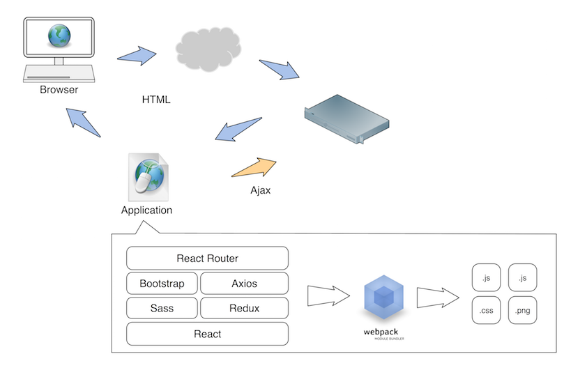

Play With React&Webpack For Single App Development
==================================================

### Get Started

#### What Is Webpack & What I Use It For

From Webpack's website it claims itself as "module bundler" which actually took
me a while to really understand what's the meaning behind. By using webpack we
could make good use of ES6, sass, less, jade or anything with specific loader to
compile all those stuff into underlaying browser aware static assets. What's more
webpack does understand the dependencies, the compiled static assets can be split
into smaller files with related content only, this is actually what I like the most.
But Webpack is more than this, it supports plugins, so if you want to customize it:
like compression, you could just apply a compression plugin to do it. Webpack also
provide tools for debugging, for example: dev-tools and dev-server which make debugging
a little bit easier. So for myself I use webpack as a compiler for compilers, one
tool to integrate all configuration for building static assets, a package tool but smart.

#### First Impression With React

React is "just the UI" framework, it encourage you to use it with other exist tools together
to carry out M and C in "MVC" pattern, but react itself only focus on V. It has better
performance because of virtual DOM and one way data flow to reduce the over complexity
traditional bi-direction data bind involves. And another thing I like react is JSX, by
using JSX the template and code can be separated more naturally and improve readability
a lot. And with the life-cycle interfaces React provide we could easily integrate with
other non-react libraries.

#### Bird's-eye view For Tools I Use To Build A Single App

Webpack and React are like the core team members I use to build a single App, but that's
not enough, there are still some necessary component like local data storage,
network interaction, UI Component libraries need to be handled properly, below is a graph
explains what are in the tool chain and how they communicate with each other.

As you can see above there are two types of arrows which marked as different color, the blue
one is non-Ajax request and the orange one is Ajax request. All non-Ajax requests will return
the same HTML page which is our application. In this single page it contains all the necessary
javascript, css, images and etc. All the data requests are go through Ajax request which is
represented by the orange arrow.

Look inside the application. As you can see Webpack is in the middle while the left side is
our source code and the right side is the compiled static assets which are actually inside
our application. Look at the left size, the UI is built by React, on above redux will work
as a storage for local state change, Axios is a network interaction component which the Ajax
requests are sent here and the response is used to update the redux state object. Sass and
Bootstrap is in charge of the appearance of the UI component. On the top is React Router,
for myself react router's behavior is kind of similar to most backend framework's url configure.
As for an application it has many features, router makes it easy to split code by different
features and provide a way to map the request(url) to underlaying module.

As a backend engineer myself, I could easily connect this whole idea to backend web framework
which react is like a template engine(not very accurate more like JSP/PHP actually), redux is
a kind of database, axios is a RPC/Http client, React Router is a micro web framework and
Webpack is like a packaging tool for example maven. As we talked about backend and frontend so
much before there is actually no end in front of us ;)

### For Development

This section will talk about how the actually development life looks like for me, and you could
find the related code in github

#### Project Layout

    ▾ app/
      ▸ actions/
      ▸ apis/
      ▸ components/
      ▸ containers/
      ▸ reducers/
      ▸ stores/
      ▸ utils/
        App.jsx
    ▸ bundle/
    ▸ font/
    ▸ image/
    ▸ scss/

Above layout is the current project layout I use. The application is implemented in the app folder,
bundle is the compiler output folder where the compiled static assets are located, scss folder is
where I put the styles, font for font file image for images. Look into app folder the layout's idead
is borrowed from this article
[Presentational and Container Components](https://medium.com/@dan_abramov/smart-and-dumb-components-7ca2f9a7c7d0#.lrp0d7746)
components are those which could be reused for multiple pages, containers are more like controllers.
For actions, reducers and stores are for redux, each folder is a represent of related component in redux. 
apis folder is for ajax api, all the ajax interfaces are defined here, containers will call those
api to read date from or write data to backend.

#### Use Webpack To Compile Static Resouce

To use Webpack we only need a config file to setup everything, below is a simple configure file I
use, and I will explain what each part of it is about below.

    module.exports = {
        entry: {
            "app": "./app/App.jsx",
            "vendor": [
                "axios",
                "core-decorators",
                "react",
                "react-chartjs",
                "react-dom",
                "react-redux",
                "react-router",
                "react-router-redux",
                "react-tap-event-plugin",
                "redux"
            ],
        },
        context: static_project_path,
        output: {
            path: path.resolve(static_project_path, "bundle"),
            filename: "[name]-bundle.js",
            publicPath: "/static/bundle/",
        },
        module: {
            loaders: [
                {
                    test: /\.jsx?$/,
                    exclude: /(node_modules)/,
                    loader: 'babel',
                    query: {
                        // stage-1 for es-class-fields-and-static-properties
                        presets: ['es2015', 'react', 'stage-1'],
                        plugins: ['transform-decorators-legacy'] // for @ syntax
                    }
                },
            ]
        },
        plugins: [
            new webpack.optimize.CommonsChunkPlugin(/* chunkName= */"vendor", /* filename= */"vendor-bundle.js"),
        ],
        resolve: {
            root: [
                path.resolve(static_project_path)
            ],
            extensions: ['', '.webpack.js', '.web.js', '.js', '.jsx']
        },
    };

Context
    Context is the basedir for reslove entry points, you could consider it as the static
    projects's root directory

Entry & Output
    Entry defines the entry points when webpack tries to compile your code which means webpack will start
looking at the entry points defined to find the whole code base dependencies. As you can see from the
example above, there are two entry points defined: one is app another is vendor. The reason why vendor
is separated from app is because vendor's code usually not changed or change not that frequently as our
application code, so split it into another file will help browser to cache vendor's code, but in order
to split it we need an extra plugin to do that which will be explained later.

Loaders
    Loaders give the possibily to preprocess files before it actually been required or imported. With
this feature we could compile jsx into javascript, sass into css, coffee script into javascript and etc.
In above example it defines how to handling jsx files, it use babel loader to compile the jsx file with
customized parameters in query.

Plugins
    Plugins usually related to the compiled file, in this example it splits the common code(vendor's code)
from application code, we could also use plugin to compress javascript or css code. 

Resolve
    Resolve defines the mechanism how webpack look at the code when it required in the code base, above
example defined the root and extensions which means the root path for webpack to looking for source code
and the possible extensions. And notice that if you have code like `require("./somefile.ext")` with
extension in it you must have an empty string in the extension definition.

#### Use React Router To Manage App Layout & Module

As I mentioned before React Router is very similar to the url mapper of backend web framework. Below code
snippets can explain why I'm saying that.

    <Router history={browserHistory}>
      <Route path="/" component={App}>
        <Route path="about" component={About}/>
        <Route path="users" component={Users}>
          <Route path="/user/:userId" component={User}/>
        </Route>
        <Route path="*" component={NoMatch}/>
      </Route>
    </Router>

As you can see that each url can be mapping to underlaying React Component, And what's more the route can be
nested into routes, which you can easily nest children into parent's node and this will help application layout
a lot. Below is an example:

    Users
    

        

        

        

            {children}
        

    

    User
    
{user.name}

So if I access /user/1232/ and assume the user's name is Tom, the page will be rendered as below:

    

        

        

        

            
Tom

        

    

See the children is be filled into the parent's node. By using this feature we could layout the menu layout
and put all subpage as children use different url pattern to switch from different sub pages.

#### Use Redux To Track State Change
As React see itself as an UI framework, we need extra help from other framework to keep track of
state change. For example after user login to need to store the user information somewhere for display, this
is where redux come in for playing. Redux provide three components to track the state change of the application,
they are action, reducer and store. Action is the data source for store, it defines what happens
in the application and reducer response to the action and decide the related state change in store, the store
it where the state is stored. Another very important thing is that the store is basically a big data object.

#### Use Axios For Network Interaction
Axios is an http client library which based on Promise interface, it provides simple interfaces for
network interaction. By simple configuration you can start to play with it, and it also provides
Interceptors which you can inspect requests and responses which makes some globally process for requests
and responses easier for example global error handling.

#### Style

Use style is deadly simple, just add the css loader in webpack configure and then you can import it
in your code. For example `import "./css/app.css"`, if you want to use sass then add another loader
for scss and import it in your code. Below is an example for webpack to import bootstrap which is
a famous style framework.

extra loaders

    {
        test: /\.scss$/,
        loader: ExtractTextPlugin.extract(["css", "sass"])
    },
    {
        test: /\.css$/,
        loader: ExtractTextPlugin.extract("style-loader", "css-loader")
    },
    {
        test: /\.(woff|woff2|ttf|eot|svg|png|gif|ico|jpg)($|\?)/,
        loader: 'file-loader?name=' + '[name].[ext]'
    }

With the above code and execute `npm install bootstrap` you could use the following code to import
bootstrap into your code

    import "./node_modules/bootstrap/dist/bootstrap.css";

But for myself I don't really like to import style sheet code in application, I like to split css
code from application code, I use sass to give a help to organize css so I could easily split css
from javascript. The idea is that I define an extra file import all the style sheet I need for the
application then I configure another entry only for styles, remove all the imports for css in exist code
and add `ExtractTextPlugin` to do the actually split. Below are the code snippets:

sass code:

    @import '~bootstrap/dist/bootstrap.css';
    @import './scss/app.scss';

Notice the `~` enable it to import from node_modules. After that we will need to add the entry and
plugins into webpack config file.

extra entry

    "style": "./scss/style.scss",

extra plugin

    new ExtractTextPlugin("[name].css")

Then you there will be extra style.css and style.js file generated, the style.js is a drawback of
this solution, it only an almost empty javascript file you could just ignore it.

#### Debugging
The last part is debugging, which actually is where we spend most of our time at. For browser debugging
source-map is a good for connect compiled code with source code, and webpack-dev-server is good for debugging
debugging with backend server.

    devtool: "source-map",
    devServer: {
        proxy: {
            '*': {
                target: devServer,
                bypass: function (req) {
                    if (req.url.startsWith('/static/bundle')) {
                        return req.url;
                    }
                    return false;
                }
            }
        },
        host: '0.0.0.0',
        port: 9876
    }

Above code snippets configured the source-map and webpack debug server, for dev server we proxy all static
request to our local environment and all non static request to backend dev server. To run the dev server
I use the following command:

    webpack-dev-server --port 9910 --inline --hot --content-base project/static/ --history-api-fallback

the --hot option enable the hot reload for static assets which make the dev process more efficient

After two weeks' playing on webpack and React, I feel like those two tools are amazing but there are also
a lot of thing need to known before we can get them into our use. A lot of things still have space for
improvements, for example webpack's documentation, but before everything is ready and prefect there are
still tons of source for learning, there are tons of project on github related to those two, so download
some famous opensource project code and try to learn from them help me a lot, I borrow a lot of things from
sentry's source code in this post. Happy exploring!
